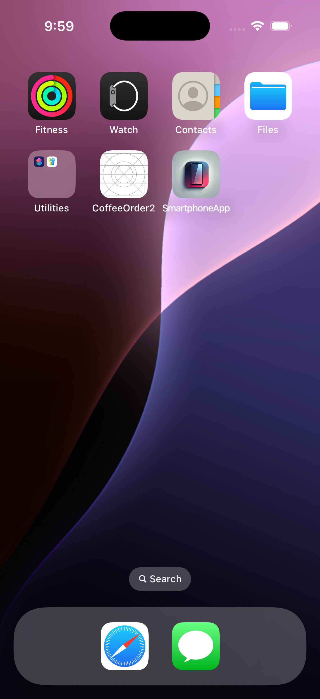
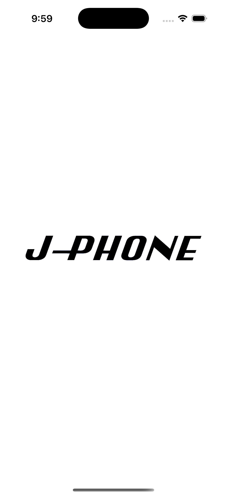
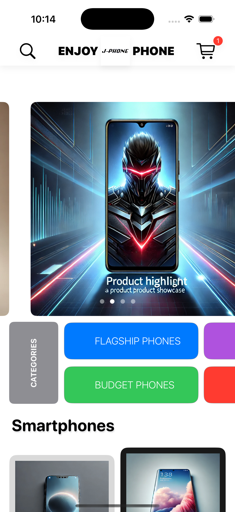
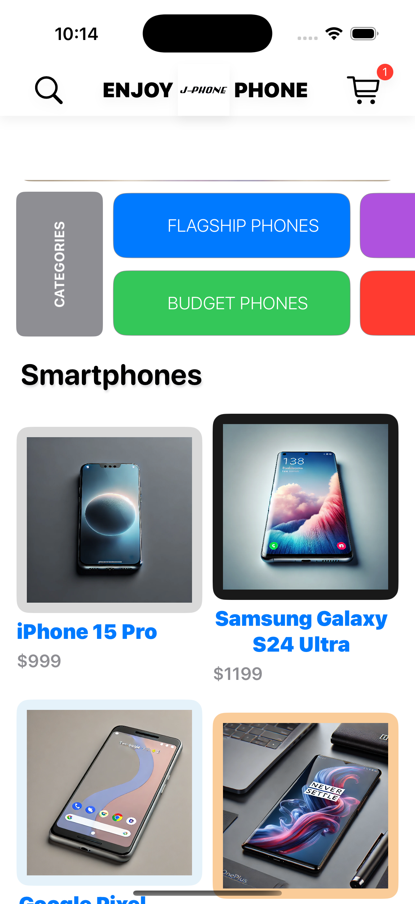
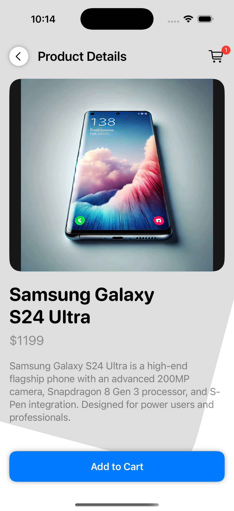
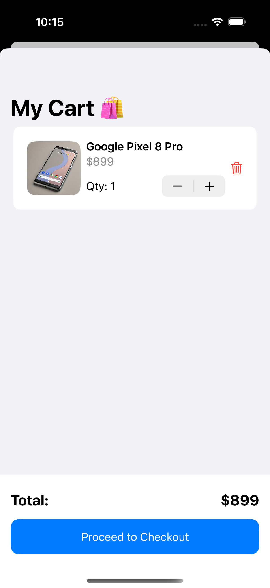
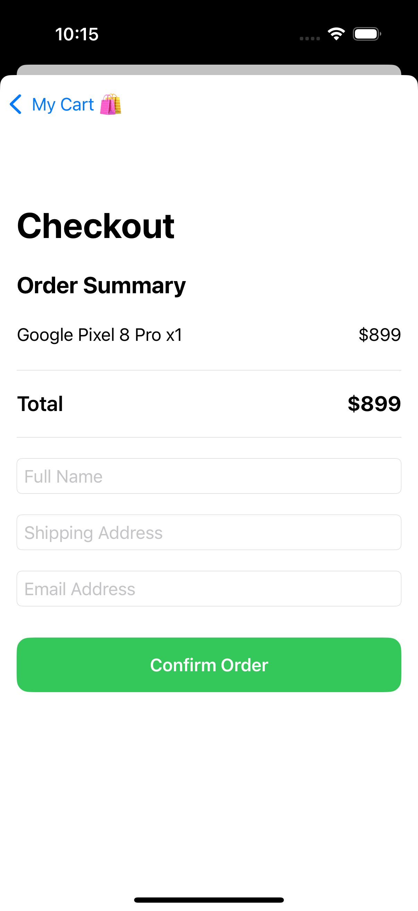
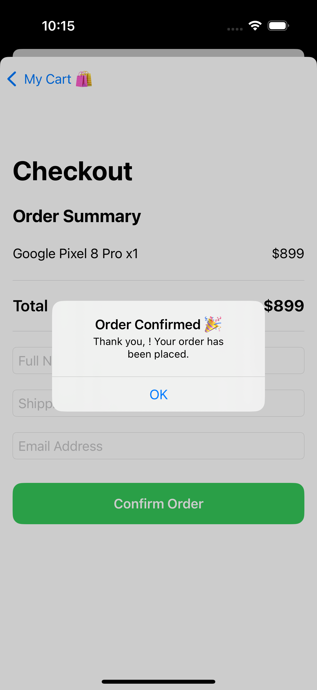
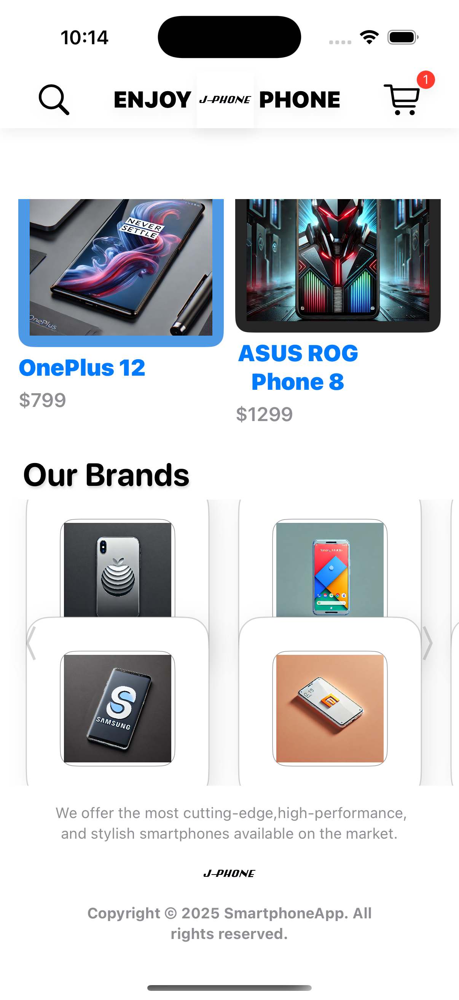

# 📱 SmartphoneApp

A modern and stylish iOS app built with SwiftUI to showcase and shop for smartphones across brands and categories.  
This app simulates an e-commerce mobile experience with product browsing, category filters, cart and checkout functionality.

---

## 🖼️ Screenshots

| Launch Screen | Home | Categories |
|---|---|---|
|  |  |  |

| Product List | Product Details | Cart |
|---|---|---|
|  |  |  |

| Checkout | Order Confirmed | Brands |
|---|---|---|
|  |  |  |

---

## 🛠️ Features

- Browse smartphone categories (flagship, budget, etc.)
- View product details and high-res images
- Add/remove products from cart
- Checkout screen with user input
- Order confirmation and summary
- Responsive SwiftUI UI with animations
- iOS simulator tested on iPhone 15 Pro

---

## 🚀 Tech Stack

- **SwiftUI**
- **MVVM Architecture**
- **Xcode**
- **iOS Simulator**

---

## 📂 Project Structure

```
SmartphoneApp/
├── App/
├── Data/
├── Model/
├── View/
├── Utility/
├── Extension/
├── Screenshots/
│   ├── screenshot-launch.png
│   ├── screenshot-home.png
│   ├── screenshot-category-view.png
│   ├── screenshot-product-list.png
│   ├── screenshot-product-details.png
│   ├── screenshot-cart.png
│   ├── screenshot-checkout.png
│   ├── screenshot-confirmation.png
│   └── screenshot-brands.png
```

---

## 📸 Demo Video

[▶️ Watch the demo video](https://github.com/Jules1Siani/SmartphoneApp/raw/main/Screenshots/smartphone-demo.mov)

---

## 👨🏽‍💻 Author

**Jules Mickael Siani**  
[GitHub Profile](https://github.com/Jules1Siani)

---

## 📄 License

This project is licensed under the [MIT License](LICENSE).
